---

# Qodo = Ai-Agents + Agentic-Toolkit

## Enterprise-Grade — Not for Vibe-Coding

Suitable for:

- Orgs with complex products, project codebases
- Software that is maintained long-term

---

# Overview

```mermaid
flowchart TD
  %% AGENTS
  subgraph A[🤖 **AGENTS**]
    gen[
      **Qodo Gen**
      *Integrates with your IDE*
      ]
    merge[
      **Qodo Merge**
      *Integrates with your Git*
      ]
    cmd[
      **Qodo Command**
      *For CLI, CI/CD, Webhooks, MCP Servers & more*
      ]
  end

  %% PLATFORM
  subgraph P[🏗️ **PLATFORM**]
    aware[
      **Qodo Aware**
      *RAG & Knowledge-graph for Qodo Agents*
      *or, served as MCP for 3rd party AI tools*
      ]
    llms[
      **Qodo LLMs**
      *Qodo-provided LLMs*
      *Zero-Data Retention*
      *or, Bring Your Own Models*
      ]
  end

  %% ENTERPRISE
  subgraph E[🏢 **ENTERPRISE**]
    sso[🔐 Single Sign-On]
    dashboard[📊 Insights & Metrics]
    support[🎯 Dedicated assistance]
  end
```

---

# Deployment Options

```mermaid
flowchart TD
  subgraph QodoInfra[**QODO**]
    C[
      **Qodo Cloud — Dedicated**
      *Isolated instance; configurable 🇪🇺 🪵*
      *Qodo LLMs or Your LLMs*
      ]
    D[
      **Qodo Cloud — Shared**
      *Shared instance 🇺🇸*
      *Qodo LLMs*
      ]
  end
  
  subgraph CustomerInfra[**CUSTOMER**]
    A[
      **On-prem &amp; Air-gapped**
      *Your Infra &amp; GPUs*
      *Fully Air-gapped*
      ]
    B[
      **On-prem or Cloud-prem**
      *Your Infra or Cloud*
      *Qodo LLMs or Your LLMs*
      ]
  end
```

