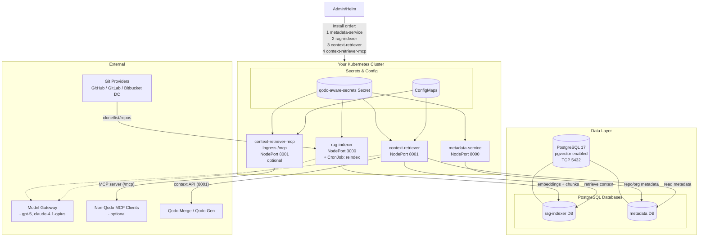
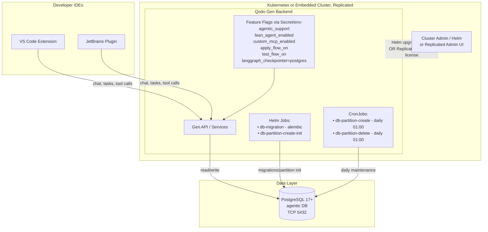
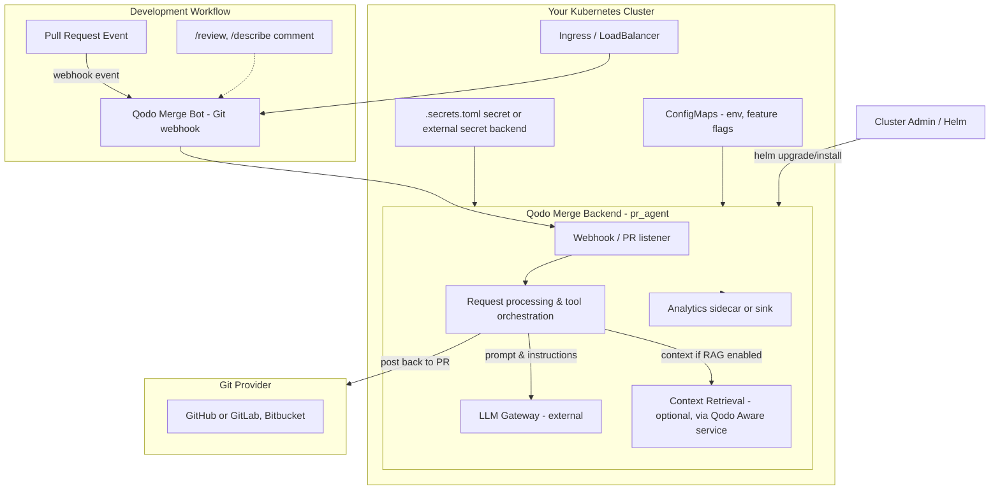

# Qodo SE :: Demos

Demos for Qodo SEs

## Agent Execution

### E2E & API Test Gen

```bash
qodo --agent-file=./Sri/agents-library/01_demo_e2e_tests.toml --yes --ci
```

### Report Generation

```bash
# Report generation on Qodo Gen VSCode extension repository
./Sri/agents-demo/qodo-gen-vscode-report.sh
```

### Compliance

```bash
# All
qodo --agent-file=./Sri/agents-library/01_demo_pr_compliance_toml --yes --ci

# GPDR
qodo --agent-file=./Sri/agents-library/01_demo_pr_compliance_gdpr.toml --yes --ci

# HIPAA
qodo --agent-file=./Sri/agents-library/01_demo_pr_compliance_hipaa.toml --yes --ci

# OWASP
qodo --agent-file=./Sri/agents-library/01_demo_pr_compliance_owasp.toml --yes --ci

# PCI-DSS
qodo --agent-file=./Sri/agents-library/01_demo_pr_compliance_pcidss.toml --yes --ci

# SOC2 Type 2
qodo --agent-file=./Sri/agents-library/01_demo_pr_compliance_soc2type2.toml --yes --ci
```

---

## On-prem

### Qodo Aware



### Qodo Gen



### Qodo Merge


